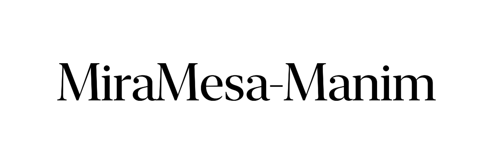

# miramesa-manim



High-fidelity text for [manim](https://www.manim.community/): real font shaping,
optical sizes, and typographic metrics.

Shapes text with a real text engine and hands manim positioned glyph outlines.
Rasterisation is unchanged — the glyphs are ordinary `VMobject`s drawn by
manim's own renderer.

## Install

```sh
pip install miramesa-manim[coretext]   # macOS
```

## Use

```python
from manim import Scene, WHITE, config
from miramesa import GlyphText, pixel_to_scene

config.frame_width = config.pixel_width / 72  # 72 px per unit -> size is in points
config.frame_height = config.pixel_height / 72


class Title(Scene):
    def construct(self):
        title = GlyphText("Hello World", font="New York", size=128)
        title.shift(pixel_to_scene(914, 696))  # pen origin at that pixel
        self.add(title)
```

`GlyphText` holds one submobject per glyph, each carrying its `cluster` (index
into the source string), so `title.chars(0, 5)` is "Hello" and can be animated
on its own. `ascent`, `descent`, and `advance` are available in scene units —
the metrics you need to sit text on a baseline instead of eyeballing a centre.

## Colour spans

Because every glyph knows which character it came from, a range of the string
can be given its own colour — by substring, by slice, or as an explicit span:

```python
GlyphText("Hello World", t2c={"World": RED})  # every occurrence
GlyphText("Hello World", t2c={"[6:11]": RED})  # a slice of the string
GlyphText("Hello World", spans=[ColorSpan(6, 11, RED)])
title.set_span_color(6, 11, RED)  # after the fact; animates
title.set_color_by_text("World", RED)
```

Both `t2c` forms index the source string — the same indices `cluster` and
`chars` use, so `t2c={"[0:5]": RED}` and `chars(0, 5)` cover the same
characters. (manim's own `Text` has two disagreeing conventions here: its
`t2c` slices index the source string, while slicing the mobject indexes
rendered characters with whitespace removed.) Where two spans overlap, the
later one wins; `t2c` is applied after `spans`.

One catch, which the package tells you about rather than papering over: a
ligature is a *single* glyph covering several characters, so it can only take
one colour. Asking for `t2c={"[0:3]": RED}` on "office" in a font that draws
"ffi" as one glyph is a request that cannot be honoured — the ligature takes
the colour of its first character, and you get a warning naming it. Pass
`ligatures=False` to shape every character as its own glyph instead.

## Backends

| backend | platform | gets you |
|---|---|---|
| `coretext` | macOS | the engine Keynote uses: `opsz`, `trak`, kerning, ligatures, glyph substitution |
| `harfbuzz` | any | portable shaping; `opsz` and `trak` applied explicitly *(planned)* |

The best available backend is chosen automatically; pass `backend="coretext"` to
pin one. A font family that cannot be found is reported and replaced with the
system font — never silently substituted.

## Fidelity

Reproducing a Keynote slide (1920×1080, New York, 44pt and 128pt), measured as
mean absolute pixel difference against the Keynote export:

| | 44pt ink box | 128pt ink box | difference |
|---|---|---|---|
| Keynote (reference) | 233 × 32 | 628 × 94 | — |
| manim `Text` | 251 × 32 | 686 × 94 | 17.18% |
| **miramesa `GlyphText`** | **233 × 33** | **628 × 94** | **0.35%** |

## Why

manim's built-in `Text` goes through Pango and an SVG round-trip. Three things
get lost on the way:

**The optical size axis never reaches the outlines.** Variable fonts carry an
`opsz` axis so a 128pt heading gets a different drawing from 12pt body copy —
thinner hairlines, tighter spacing, higher contrast. Pango feeds the axis into
shaping but hands the rasteriser outlines pinned at the bottom of the axis, so
every size gets the small-text cut. Measured on Apple's New York, the `H` glyph
comes out 0.7441 em wide at *every* size, while the design ranges from 0.7441
down to 0.6611:

| requested `opsz` | design `H` width | what manim draws |
|---|---|---|
| 12 | 0.7441 em | 0.7441 em |
| 44 | 0.7231 em | 0.7441 em |
| 128 | 0.6875 em | 0.7441 em |
| 256 | 0.6611 em | 0.7441 em |

**Apple's typographic tables are ignored.** `trak` (size-dependent tracking) has
no equivalent in the Pango stack, so Apple fonts set several percent too loose.

**Every metric except the ink bounding box is discarded.** No baseline, no
ascent, no advance, no mapping from glyph back to character — so placing text on
a baseline, or animating one word, means recomputing the font metrics yourself.

## Status

Alpha. Single-line text only; multi-line and the HarfBuzz backend are next.

Rendering is verified against the cairo renderer. Under `--renderer=opengl` the
class re-bases onto `OpenGLVMobject` through manim's `ConvertToOpenGL`
metaclass — the same mechanism `SVGMobject` uses, with the same caveat that it
resolves at import time — but the output has not been checked yet.

`DEFAULT_STEM_DARKENING` compensates for cairo rasterising lighter than Core
Graphics. It is calibrated against one reference, black on white; real font
smoothing is a gamma-weighted blend rather than a uniform dilation, so it may
need revisiting for light-on-dark text. Pass `stem_darkening=0` for raw outlines.

## License

MIT
